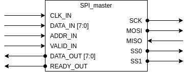
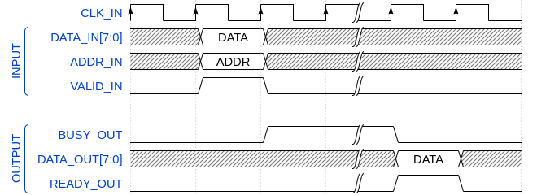

# SPI Master Module

A SPI master block is implemented in Verilog. The module presents a parallel interface to be used within internal modules and the SPI interface itself. A block diagram for the SPI master block is presented:

There are two interfaces for the SPI master module: system and serial. System interface is in charge of communicating with the system while the serial interface provide the communication to peripherals.

## System Interface
The system interface is the set of inputs and outputs that are used by the system. The system interfaces has data input and output ports, an address and three flags. Data input and output ports use a default 8-bit word size. The address is a single bit that handles the peripheral chip select. A valid flag is used by the system to indicate that a transaction must take place. Finally, two flags are used to indicate the system if the module is busy and/or the transaction is ready.

