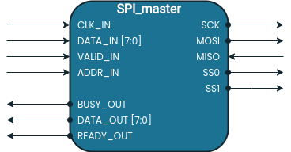

# SPI Master Module

A SPI master block is implemented in Verilog. The module presents a parallel interface to be used within internal modules and the SPI interface itself. A block diagram for the SPI master block is presented:

## Parallel Interface

